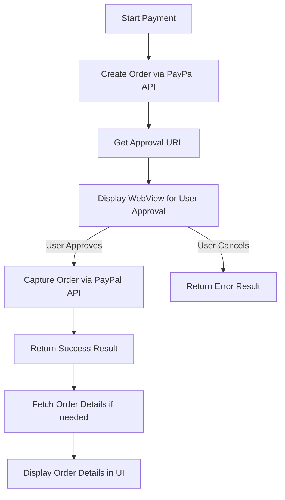

# PayPal Flutter Example

This example demonstrates how to integrate **PayPal Checkout** in a Flutter app using the [`paypal_flutter`](https://github.com/rojanshr1996/paypal_flutter) package. It shows how to create orders, display the approval flow in a WebView, capture payments, and handle success or error responses.

---

## Table of Contents

* [Features](#features)
* [Prerequisites](#prerequisites)
* [Setup](#setup)
* [Environment Variables](#environment-variables)
* [App Flow](#app-flow)
* [Flow Diagram](#flow-diagram)
* [Code Structure](#code-structure)
* [State Management](#state-management)
* [Running the Example](#running-the-example)
* [Screenshots](#screenshots)

---

## Features

* Create a PayPal order using the Orders API
* Display the PayPal approval page inside a WebView
* Capture the order after user approval
* Handle success and error responses
* Display order details after successful payment
* Configurable for **sandbox** and **production** environments

---

## Prerequisites

* Flutter 3.0+
* Dart 3.0+
* A PayPal developer account with sandbox and/or live credentials
* Knowledge of BLoC/Cubit pattern for state management
* Understanding of clean architecture principles

---

## Setup

1. Clone the repository:

```bash
git clone <repo_url>
```

2. Install dependencies:

```bash
flutter pub get
```

3. Create a `.env` file in the root of the project:

```env
PAYPAL_CLIENT_ID=your_sandbox_client_id
PAYPAL_CLIENT_SECRET=your_sandbox_client_secret
```

> **Note:** Keep the client secret private. For production apps, consider using a secure backend to store and fetch credentials instead of exposing them in the client.

---

## Environment Variables

* `PAYPAL_CLIENT_ID` – Your PayPal Client ID
* `PAYPAL_CLIENT_SECRET` – Your PayPal Client Secret

The app uses [flutter\_dotenv](https://pub.dev/packages/flutter_dotenv) to load these values at runtime.

---

## App Flow

1. **Initialize Dependencies & State Management**

   * Service locator (`getIt`) initializes dependencies using clean architecture
   * `OrderDetailsCubit` is provided via `BlocProvider` for state management
   * The app reads PayPal credentials from `.env` file
   * `PaypalConfig` is initialized with `sandbox` or `production` environment

2. **Create an Order**

   * `CreateOrderRequestModel` specifies payment details, amount, currency, and return/cancel URLs
   * The app calls `PaypalOrdersService.createOrder()` to get the PayPal approval URL

3. **Display Approval Page**

   * The approval page is displayed in a WebView using `PaypalCheckoutPage`
   * User logs into PayPal and approves or cancels the payment

4. **Capture the Payment**

   * If the user approves, the app captures the payment using `PaypalOrdersService.captureOrder()`
   * The result is returned in `PaypalPaymentSuccessModel`

5. **State Management & Order Details**

   * On successful payment, `OrderDetailsCubit.getOrderDetails()` is called
   * Cubit manages three states: `Loading`, `Success`, and `Error`
   * `BlocBuilder` listens to state changes and updates UI accordingly
   * Order details are displayed in a card with ID, status, amount, and payer info

6. **Show Success/Error**

   * On success, a dialog shows the order ID and token
   * On error or cancellation, a snackbar displays the error message
   * Order details are fetched and displayed using Cubit state management

---

## Flow Diagram



This diagram shows the complete flow including clean architecture setup, state management with Cubit, and UI updates through BlocBuilder.

---

## Code Structure

### Clean Architecture Layers

#### Presentation Layer
* `order/presentation/bloc/order_details_cubit/` – State management layer
  * `order_details_cubit.dart` – Cubit for managing order details state
  * `order_details_state.dart` – State definitions (Loading, Success, Error)

#### Domain Layer
* `order/domain/entities/` – Business entities
* `order/domain/repositories/` – Repository interfaces

#### Data Layer
* `order/data/repositories/` – Repository implementations
* `order/data/datasources/` – Remote and local data sources
* `order/data/models/` – Data transfer objects

#### Core
* `core/service_locator.dart` – Dependency injection setup using GetIt

### Main Application

* `main.dart` – App entry point with MultiBlocProvider setup
* `PayPalExamplePage` – Main UI with PayPal integration and BlocBuilder

### PayPal Integration

* `PaypalCheckoutPage` – Handles WebView flow and capturing payment
* `PaypalOrdersService` – Service class for interacting with PayPal APIs
* `PaypalConfig` – Holds client credentials and generates access tokens
* `PayPalButtonWidget` – Reusable button widget to trigger PayPal checkout

### Models & Exceptions

* `exceptions/` – Custom exception classes
* `models/` – Request and response models using `freezed`

## State Management

The example uses **Cubit** (part of the BLoC library) for state management:

### OrderDetailsCubit States

* `Loading` - When fetching order details from PayPal API
* `Success(orderDetailsData)` - Contains the fetched order details
* `Error(message)` - Contains error message if API call fails

### Usage in UI

```dart
BlocBuilder<OrderDetailsCubit, OrderDetailsState>(
  builder: (context, orderDetailsState) {
    switch (orderDetailsState) {
      case Loading():
        return const CircularProgressIndicator();
      case Success(orderDetailsData: final orderDetails):
        return OrderDetailsCard(orderDetails);
      case Error(message: final message):
        return ErrorWidget(message);
    }
  },
)
```

### Dependency Injection

The app uses **GetIt** for dependency injection, configured in `service_locator.dart`:

```dart
void initServiceLocator() {
  getIt.registerFactory<OrderDetailsCubit>(() => OrderDetailsCubit());
}
```

---

## Running the Example

```bash
flutter run
```

* Tap the **Pay with PayPal** button to start checkout.
* Approve or cancel the payment in the WebView.
* On success, the app will show a dialog with order details.

---

This example can serve as a starting point for integrating **PayPal Checkout** in production apps, including handling network errors, capturing orders, and fetching order details.
