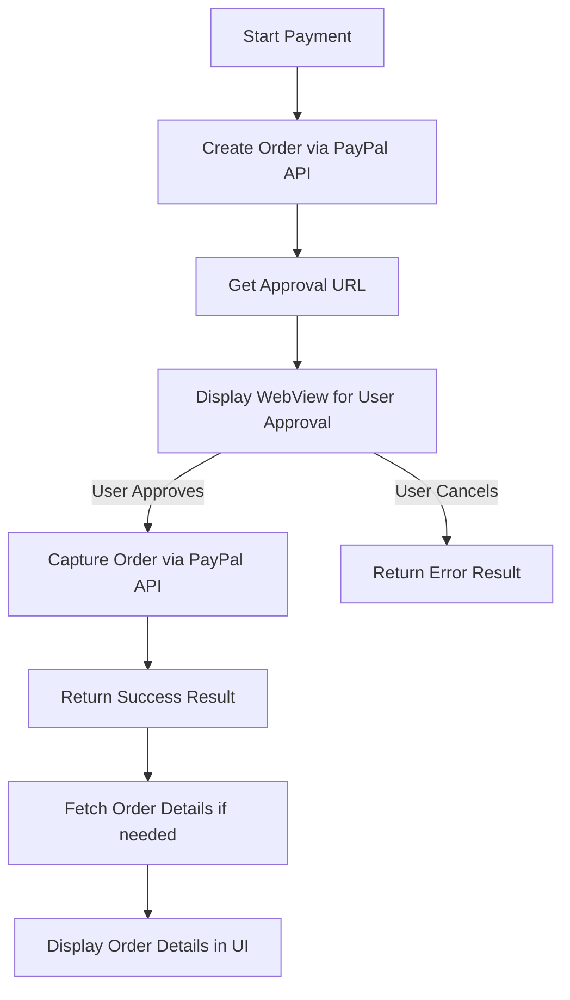

# PayPal Flutter Example

This example demonstrates how to integrate **PayPal Checkout** in a Flutter app using the [`paypal_flutter`](https://github.com/rojanshr1996/paypal_flutter) package. It shows how to create orders, display the approval flow in a WebView, capture payments, and handle success or error responses.

---

## Table of Contents

* [Features](#features)
* [Prerequisites](#prerequisites)
* [Setup](#setup)
* [Environment Variables](#environment-variables)
* [App Flow](#app-flow)
* [Flow Diagram](#flow-diagram)
* [Code Structure](#code-structure)
* [Running the Example](#running-the-example)
* [Screenshots](#screenshots)

---

## Features

* Create a PayPal order using the Orders API
* Display the PayPal approval page inside a WebView
* Capture the order after user approval
* Handle success and error responses
* Display order details after successful payment
* Configurable for **sandbox** and **production** environments

---

## Prerequisites

* Flutter 3.0+
* Dart 3.0+
* A PayPal developer account with sandbox and/or live credentials

---

## Setup

1. Clone the repository:

```bash
git clone <repo_url>
cd paypal_flutter_example
```

2. Install dependencies:

```bash
flutter pub get
```

3. Create a `.env` file in the root of the project:

```env
PAYPAL_CLIENT_ID=your_sandbox_client_id
PAYPAL_CLIENT_SECRET=your_sandbox_client_secret
```

> **Note:** Keep the client secret private. For production apps, consider using a secure backend to store and fetch credentials instead of exposing them in the client.

---

## Environment Variables

* `PAYPAL_CLIENT_ID` – Your PayPal Client ID
* `PAYPAL_CLIENT_SECRET` – Your PayPal Client Secret

The app uses [flutter\_dotenv](https://pub.dev/packages/flutter_dotenv) to load these values at runtime.

---

## App Flow

1. **Initialize the PayPal Service**

   * The app reads your client ID and secret from `.env`.
   * `PaypalConfig` is initialized with `sandbox` or `production` environment.
   * `PaypalOrdersService` handles API requests.

2. **Create an Order**

   * `CreateOrderRequestModel` specifies the payment details, amount, currency, and return/cancel URLs.
   * The app calls `PaypalOrdersService.createOrder()` to get the PayPal approval URL.

3. **Display Approval Page**

   * The approval page is displayed in a WebView using `PaypalCheckoutPage`.
   * User logs into PayPal and approves or cancels the payment.

4. **Capture the Payment**

   * If the user approves, the app captures the payment using `PaypalOrdersService.captureOrder()`.
   * The result is returned in `PaypalPaymentSuccessModel`.

5. **Show Success/Error**

   * On success, a dialog shows the order ID and token.
   * On error or cancellation, a snackbar displays the error message.
   * Order details can be fetched using `getOrderDetails()`.

---

## Flow Diagram



This diagram shows the complete flow from creating an order to capturing the payment and displaying details.

---

## Code Structure

* `main.dart` – Example app entry point
* `PayPalExamplePage` – Main UI with button to start checkout
* `PaypalCheckoutPage` – Handles WebView flow and capturing payment
* `PaypalOrdersService` – Service class for interacting with PayPal APIs
* `PaypalConfig` – Holds client credentials and generates access tokens
* `PayPalButtonWidget` – Reusable button widget to trigger PayPal checkout
* `exceptions/` – Custom exception classes
* `models/` – Request and response models using `freezed`

---

## Running the Example

```bash
flutter run
```

* Tap the **Pay with PayPal** button to start checkout.
* Approve or cancel the payment in the WebView.
* On success, the app will show a dialog with order details.

---

This example can serve as a starting point for integrating **PayPal Checkout** in production apps, including handling network errors, capturing orders, and fetching order details.
